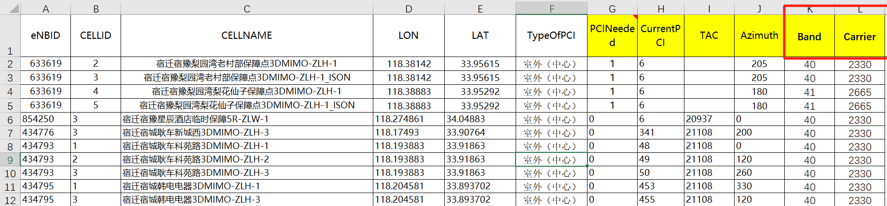

# 顺盛集成工具使用说明

该工具目前包括六大功能模块：规划工具、功率核查、互操作核查、excel处理、PDF处理和xml处理，主要集成了现场使用需求比较多的工具。

## 一、登录、注册模块

登录前需要先注册，注册时请使用公司邮箱作为账号，否则无法注册。

遇到以下错误时，可能是公司邮箱账号未录入工具，联系邮箱：wangxinyue@shunscom.com处理即可。

## 二、 规划模块

###  2.1 PCI|TAC规划

1. 选择待规划表：表格必须是.xlsx格式，内容格式模板如下：

 

**PCINeeded：0表示不规划PCI；1表示规划PCI；**

CurrentPCI：当时小区所使用的PCI，**待规划小区使用的PCI，随便填个数字即可，不可空缺。**

TAC：当时小区所使用的TAC，待规划小区使用的TAC，可空缺。

**Azimuth：小区PCI 模的选择根据方位角决定，故方位角务必填写准确。室分一般为全向天线，方位角0，同一物理点多个室分小区规划PCI时，为未免模3干扰，请手动调整室分方位角**，如：一个物理点开3个小区，规划PCI时，方位角可分别设置为0，120，240.

文件选择步骤如下：

 

2. 输出结果路径：

 

3. 输出结果表名：默认值 PCI规划表，可修改。
4. PCI复用距离：单位（米），默认值3000，可修改
5. PCI使用起始值和PCI使用结束值：LTE PCI 0~503共504个，NR PCI 0~1007共1008个，默认值0，1007。由于现场可能存在预留一部分PCI给室分或特殊场景使用，故工具开发时将PCI使用范围设置为可修改，有利于现场根据实际情况调整。
6. M0、M1、M2方位角起始值:为避免模3冲突，根据小区方位角确定其PCI 模的选择。一般情况下（默认值）：300~60度为模0，60~180度为模1，180~300度为模2。该值也可调整，调整时只需要修改M0方位角起始值即可，M1和M2会根据M0的值进行自动调整，调整幅度120度。
7. Prach复用距离：单位（米），默认值5000，可修改。
8. 前导格式：839(长格式)/139(短格式)，默认值839，可修改。
9. Ncs：不需要填写，该值根据Prach复用距离和前导格式推算生成，执行后，可自动呈现。
10. 收件人邮箱：选填。填写格式：[18921790946@139.com](mailto:18921790946@139.com)或18921790946<[18921790946@139.com](mailto:18921790946@139.com)>
11. 两种格式均可使用，两个邮箱之间用**英文逗号**分隔。（目前公司邮箱没有发送成功，大家使用时优先使用139或163邮箱）
12. 选择PCI规划模式：全频段（默认）、分频段、分频点

#### 2.1.1 模板

### 2.2 邻区规划

1. 选择待规划表、选择全网工参：表格必须是.xlsx格式，内容格式模板如下：（标黄列是必填列，其他列选填）

选择待规划表,内容格式：

选择全网工参,内容格式：

务必保证经纬度、方位角、TA准确性。TA单位（米），待规划表中的TA，填写估测的小区覆盖距离，工参表中的TA，填写网管TA均值。

文件选择步骤如下：

2. 输出结果路径：

   

   

3. 输出结果表名：默认值 邻区规划表，可修改。

4. 规划小区覆盖半径：和待规划表中的TA是一个概念，以表格中的为准，此处可忽略。

5.  强相关半径：单位（米），默认值1000，该范围内的邻区必须添加，该参数可根据实际情况修改。如：密集城区，周围站点过多的情况下，可根据距离远近排定邻区添加优先级，距离越近，优先级越高。

6. 丢弃半径：单位（米），默认值5000，该参数与强相关半径相反，两小区间距离大于该参数值时，邻区舍弃。

7.  可规划重叠比例：该参数根据经纬度确定位置、方位角确定方向、半功率角确定覆盖宽度，TA确定覆盖距离，计算两小区之间的重叠覆盖面积。重叠比例=重叠覆盖面积/邻区覆盖面积，默认值为0.1，即重叠覆盖低于该参数值时，邻区舍弃。

8.  半功率角修正参数、TA修正参数:由于无线环境复杂，扇区辐射的范围可能存在偏差，故设置了修正参数调整，尽可能使规划结果准确。默认值1.5，可修改。

9.  收件人邮箱：说明同PCI|TAC规划章节。

####  2.2.2 模板

##  三、功率核查

选择文件：可以选择多个excel文件；

移除文件：选择文件后，如不需要可以使用按按钮进行移除；

执行并保存: 点击后，会先选择保存文件路径，然后直接执行功率核查。

###  3.1 功率核查涉及**MOC表

| 网管 | 制式    | MOC                  | 网管 | 制式 | MOC                       |
| ---- | ------- | -------------------- | ---- | ---- | ------------------------- |
| UME  | MIMO    | DUEUtranCellTDDLTE   | U31  | FDD  | ECellEquipmentFunction    |
| UME  | MIMO    | DUEUtranCellFDDLTE   | U31  | FDD  | EUtranCellFDD             |
| UME  | MIMO    | CUEUtranCellFDDLTE   | U31  | TDD  | ECellEquipmentFunctionTDD |
| UME  | MIMO    | CUEUtranCellTDDLTE   | U31  | TDD  | EUtranCellTDD             |
| UME  | MIMO    | ECellEquipFuncFDDLTE | U31  | FDD  | ECellEquipFuncFDDLTE      |
| UME  | MIMO    | ECellEquipFuncTDDLTE | U31  | TDD  | ECellEquipFuncTDDLTE      |
| UME  | MIMO/NR | SectorFunction       | U31  | FDD  | EUtranCellFDDLTE          |
| UME  | MIMO/NR | AauTxRxGroup         | U31  | TDD  | EUtranCellTDDLTE          |
| UME  | MIMO/NR | PrruTxRxGroup        | U31  | SDR  | RfDevice                  |
| UME  | MIMO/NR | IrRruTxRxGroup       | U31  | SDR  | BpDevice                  |
| UME  | NR      | NRSectorCarrier      | U31  | NB   | ECellEquipmentFunctionNB  |
| UME  | NR      | PowerControlDL       | U31  | NB   | CarrierNB                 |
| UME  | NR      | CPList               | U31  | GSM  | GCellEquipmentFunction    |
| UME  | NR      | NRCarrier            | U31  | GSM  | GCell                     |
| UME  | MIMO/NR | BpPoolFunction       | UME  | NR   | NRCellDU                  |
| UME  | MIMO/NR | ReplaceableUnit      | UME  | NR   | CarrierDL                 |
| UME  | MIMO/NR | RfLink               |      |      |                           |

###  3.2 设备额定功率及核查标准

工具路径下**MyRS**文件中的额定功率.xlsx和标准.xlsx中的内容可以按模板中的格式进行修改。

额定功率是RRU或AAU的额定功率；标准是功率的核查标准（目前只是5G的核查江苏省的核查标准，按设备功率进行判断，如现场需要其他的判断条件，需要反馈调整工具）

###  3.3 设备功率计算方法

1、FDD共模的RRU功率计算：

以FDD1800的4通道*40W的RRU为例：

FDD的RRU功率是均分的，不考虑2G的情况下：开几个通道，及最大发射功率就可以配至最大值，即1通道40W，2通道80W，4通道160W；

考虑2G的情况下：

用(40W-2G最大通道发射功率）*4即为FDD1800可配置的最大发射功率,如：

2G配置为2个通道，1通道为10W，4通道为20W，那么FDD1800在配置4通道的情况下功率可配置的最大值即为：

（40W-20W）*4=80W；

2、基于共模RRU功率计算总结LTE功率计算，**以RRU通道为单位计算RRU功率余量**：

1)   计算基带资源引用的通道数

以基带资源表—TDD(上行激活天线位图);FDD(下行天线配置映射位图) 数字1的所在位置确定RRU发射通道

2)   计算基带资源引用RRU通道可发送的最大功率

(单通道额定功率-gsm&NB使用功率)*通道数（或者累计求和）。一般情况下一个基带资源下的通道额定功率是一致的，为避免不一致情况，将计算公式优化为**min(通道1-** **gsm&NB****使用功率，通道2-** **gsm&NB****使用功率…)\*通道数

3)   计算RRU各通道4G总使用功率，累加求和（主要为多载波场景需要求和）

4)   计算功率余量W

基带资源引用RRU通道可发送的最大功率-sum(通道1_4G使用功率，通道2_4G使用功率…) ---工具中未体现该计算方式

5)   计算可提升功率余量W

**基带资源引用RRU通道可发送的最大功率-max(通道1_4G总使用功率，通道2_4G总使用功率…) \*通道数**

———————————————————————————————————————

3、区别，举例说明：假设一个4通道RRU 4*20W，开通2个小区，A小区引用1、4通道发送功率网管配置20W（通道功率是平均，即网管功率/使用通道数）B小区引用1发送功率网管配置10W，按以上配置A小区 4通道还剩10W功率可用，但通道1已满配，这种情况下网管引用RRU通道剩余功率10W，A小区功率无法提升，实际该RRU设备功率余量50W（2、3通道未使用）。

##  四、互操作核查

互操作核查界面同功率核查界面。目前仅支持4G网管ICM导出的数据。

### 4.1 ICM互操作涉及参数

| MOC                                                          | 参数                               | 参数中文名称                              |
| ------------------------------------------------------------ | ---------------------------------- | ----------------------------------------- |
| EUtranCellTDD/EUtranCellFDD/EUtranCellFDDLTE/EUtranCellTDDLTE | MOI                                | 管理对象标识                              |
| EUtranCellTDD/EUtranCellFDD/EUtranCellFDDLTE/EUtranCellTDDLTE | SubNetwork                         | 子网ID                                    |
| EUtranCellTDD/EUtranCellFDD/EUtranCellFDDLTE/EUtranCellTDDLTE | MEID                               | 网元ID                                    |
| EUtranCellTDD/EUtranCellFDD/EUtranCellFDDLTE/EUtranCellTDDLTE | ENBFunctionTDD/ENBFunctionFDD      | 基站ID                                    |
| EUtranCellTDD/EUtranCellFDD/EUtranCellFDDLTE/EUtranCellTDDLTE | userLabel                          | 用户标识                                  |
| EUtranCellTDD/EUtranCellFDD/EUtranCellFDDLTE/EUtranCellTDDLTE | cellLocalId                        | 小区标识                                  |
| EUtranCellTDD/EUtranCellFDD/EUtranCellFDDLTE/EUtranCellTDDLTE | pci                                | 物理小区识别码                            |
| EUtranCellTDD/EUtranCellFDD/EUtranCellFDDLTE/EUtranCellTDDLTE | tac                                | 跟踪区码                                  |
| EUtranCellTDD/EUtranCellFDD/EUtranCellFDDLTE/EUtranCellTDDLTE | bandIndicator/freqBandInd          | 频段指示                                  |
| EUtranCellTDD/EUtranCellFDD/EUtranCellFDDLTE/EUtranCellTDDLTE | earfcn/earfcnDl                    | 中心载频                                  |
| EUtranCellTDD/EUtranCellFDD/EUtranCellFDDLTE/EUtranCellTDDLTE | bandWidth/bandWidthDl              | 带宽                                      |
| EUtranCellMeasurementTDD/EUtranCellMeasurement/EUtranCellMeasFDDLTE/EUtranCellMeasTDDLTE | MOI                                | 管理对象标识                              |
| EUtranCellMeasurementTDD/EUtranCellMeasurement/EUtranCellMeasFDDLTE/EUtranCellMeasTDDLTE | eutranMeasParas_interCarriFreq     | 异频载频                                  |
| EUtranCellMeasurementTDD/EUtranCellMeasurement/EUtranCellMeasFDDLTE/EUtranCellMeasTDDLTE | refCellMeasGroup                   | 测量配置索引组ID                          |
| EUtranReselectionTDD/EUtranReselection/EUtranReselectionTDDLTE/EUtranReselectionFDDLTE | MOI                                | 管理对象标识                              |
| EUtranReselectionTDD/EUtranReselection/EUtranReselectionTDDLTE/EUtranReselectionFDDLTE | selQrxLevMin                       | 小区选择所需的最小RSRP接收水平(dBm)       |
| EUtranReselectionTDD/EUtranReselection/EUtranReselectionTDDLTE/EUtranReselectionFDDLTE | qrxLevMinOfst                      | 小区选择所需的最小RSRP接收电平偏移(dB)    |
| EUtranReselectionTDD/EUtranReselection/EUtranReselectionTDDLTE/EUtranReselectionFDDLTE | qhyst                              | 服务小区重选迟滞(dB)                      |
| EUtranReselectionTDD/EUtranReselection/EUtranReselectionTDDLTE/EUtranReselectionFDDLTE | snonintrasearch                    | 同/低优先级RSRP测量判决门限(dB)           |
| EUtranReselectionTDD/EUtranReselection/EUtranReselectionTDDLTE/EUtranReselectionFDDLTE | threshSvrLow                       | 服务载频低门限(dB)                        |
| EUtranReselectionTDD/EUtranReselection/EUtranReselectionTDDLTE/EUtranReselectionFDDLTE | cellReselectionPriority            | 频内小区重选优先级                        |
| EUtranReselectionTDD/EUtranReselection/EUtranReselectionTDDLTE/EUtranReselectionFDDLTE | intraQrxLevMin                     | 频内小区重选最小接收水平(dBm)             |
| EUtranReselectionTDD/EUtranReselection/EUtranReselectionTDDLTE/EUtranReselectionFDDLTE | eutranRslPara_interReselPrio       | 频间小区重选优先级                        |
| EUtranReselectionTDD/EUtranReselection/EUtranReselectionTDDLTE/EUtranReselectionFDDLTE | eutranRslPara_interThrdXLow        | 重选到异载频低优先级的RSRP低门限(dB)      |
| EUtranReselectionTDD/EUtranReselection/EUtranReselectionTDDLTE/EUtranReselectionFDDLTE | eutranRslPara_interThrdXHigh       | 重选到异载频高优先级的RSRP高门限(dB)      |
| EUtranReselectionTDD/EUtranReselection/EUtranReselectionTDDLTE/EUtranReselectionFDDLTE | eutranRslPara_interQrxLevMin       | 频间小区重选所需要的最小RSRP接收水平(dBm) |
| EUtranReselectionTDD/EUtranReselection/EUtranReselectionTDDLTE/EUtranReselectionFDDLTE | eutranRslPara_interCarriFreq       | 异频载频(MHZ)                             |
| EUtranReselectionTDD/EUtranReselection/EUtranReselectionTDDLTE/EUtranReselectionFDDLTE | eutranRslParaExt_interReselPrioExt | 频间小区重选优先级                        |
| EUtranReselectionTDD/EUtranReselection/EUtranReselectionTDDLTE/EUtranReselectionFDDLTE | eutranRslParaExt_interThrdXLowExt  | 重选到异载频低优先级的RSRP低门限(dB)      |
| EUtranReselectionTDD/EUtranReselection/EUtranReselectionTDDLTE/EUtranReselectionFDDLTE | eutranRslParaExt_interThrdXHighExt | 重选到异载频高优先级的RSRP高门限(dB)      |
| EUtranReselectionTDD/EUtranReselection/EUtranReselectionTDDLTE/EUtranReselectionFDDLTE | eutranRslParaExt_interQrxLevMinExt | 频间小区重选所需要的最小RSRP接收水平(dBm) |
| EUtranReselectionTDD/EUtranReselection/EUtranReselectionTDDLTE/EUtranReselectionFDDLTE | eutranRslParaExt_interCarriFreqExt | 扩展的邻接异频载频(MHz)(MHZ)              |
| UeEUtranMeasurementTDD/UeEUtranMeasurement/UeEUtranMeasurementLTE | MOI                                | 管理对象标识                              |
| UeEUtranMeasurementTDD/UeEUtranMeasurement/UeEUtranMeasurementLTE | measCfgIdx                         | 测量配置号                                |
| UeEUtranMeasurementTDD/UeEUtranMeasurement/UeEUtranMeasurementLTE | eventId                            | 事件标识                                  |
| UeEUtranMeasurementTDD/UeEUtranMeasurement/UeEUtranMeasurementLTE | thresholdOfRSRP                    | 事件判决的RSRP门限(dBm)                   |
| UeEUtranMeasurementTDD/UeEUtranMeasurement/UeEUtranMeasurementLTE | a5Threshold2OfRSRP                 | A5事件判决的RSRP绝对门限2(dBm)            |
| CellMeasGroupTDD/CellMeasGroup/CellMeasGroupLTE              | MOI                                | 管理对象标识                              |
| CellMeasGroupTDD/CellMeasGroup/CellMeasGroupLTE              | closedInterFMeasCfg                | 关闭频间/系统间测量的测量配置             |
| CellMeasGroupTDD/CellMeasGroup/CellMeasGroupLTE              | openInterFMeasCfg                  | 打开频间测量的测量配置                    |
| CellMeasGroupTDD/CellMeasGroup/CellMeasGroupLTE              | interFHOMeasCfg                    | 基于覆盖的异频切换测量配置                |

### 4.2 ICM创建模板，方便日常导出

备注：可以只导需要的41个参数，减少数据量，提高工具运行效率。

### 4.3 NR互操作核查

NR-NR为核查系统内互操作

NR-LTE为核查系统间互操作

由于5G切换数据和语音使用的不同策略，所以**切换对象标识和A1A2对象标识**用来区分数据还是语音的。以江苏为例:数据为default和1，语音为21和21.

5-5参数表：

| 管理对象名称               | 索引                                    |
| -------------------------- | --------------------------------------- |
| CoverMobilityInterFMeasCfg | [CoverMobilityInterFMeasCfg](#RANGE!A1) |
| InterFMeasObject           | [InterFMeasObject](#RANGE!A1)           |
| NRInterFCovHo              | [NRInterFCovHo](#RANGE!A1)              |
| NRFreqRelation             | [NRFreqRelation](#RANGE!A1)             |
| NRFreq                     | [NRFreq](#RANGE!A1)                     |
| NRCellDU                   | [NRCellDU](#RANGE!A1)                   |
| NRCellCU                   | [NRCellCU](#RANGE!A1)                   |
| CellDefiningSSB            | [CellDefiningSSB](#RANGE!A1)            |
| InterFHoA1A2               | [InterFHoA1A2](#RANGE!A1)               |
| NRBlindRd                  | [NRBlindRd](#RANGE!A1)                  |
| InterFReselection          | [InterFReselection](#RANGE!A1)          |
| CellResel                  | [CellResel](#RANGE!A1)                  |

5-4参数表：

| 管理对象名称                | 索引                                     |
| --------------------------- | ---------------------------------------- |
| CoverMobilityLTEFreqMeasCfg | [CoverMobilityLTEFreqMeasCfg](#RANGE!A1) |
| MeasObjEUTRA                | [MeasObjEUTRA](#RANGE!A1)                |
| EutranFreqRelation          | [EutranFreqRelation](#RANGE!A1)          |
| EutranFreq                  | [EutranFreq](#RANGE!A1)                  |
| LTEFreqCovHo                | [LTEFreqCovHo](#RANGE!A1)                |
| InterRatHoA1A2              | [InterRatHoA1A2](#RANGE!A1)              |
| NRBlindRd                   | [NRBlindRd](#RANGE!A1)                   |
| NRCellCU                    | [NRCellCU](#RANGE!A1)                    |
| NRCellDU                    | [NRCellDU](#RANGE!A1)                    |
| CellDefiningSSB             | [CellDefiningSSB](#RANGE!A1)             |
| EUTRAReselection            | [EUTRAReselection](#RANGE!A1)            |
| CellResel                   | [CellResel](#RANGE!A1)                   |

### 4.4 TMM互操作核查

参数表：

| 管理对象名称            | 索引                                 |
| ----------------------- | ------------------------------------ |
| UeEUtranMeasurementLTE  | [UeEUtranMeasurementLTE](#RANGE!A1)  |
| CellMeasGroupLTE        | [CellMeasGroupLTE](#RANGE!A1)        |
| CUEUtranCellFDDLTE      | [CUEUtranCellFDDLTE](#RANGE!A1)      |
| EUtranCellMeasFDDLTE    | [EUtranCellMeasFDDLTE](#RANGE!A1)    |
| EUtranMeasFDDLTE        | [EUtranMeasFDDLTE](#RANGE!A1)        |
| EUtranReselectionFDDLTE | [EUtranReselectionFDDLTE](#RANGE!A1) |
| EUtranRslParaFDD        | [EUtranRslParaFDD](#RANGE!A1)        |
| EUtranRslExtFDD         | [EUtranRslExtFDD](#RANGE!A1)         |
| CUEUtranCellTDDLTE      | [CUEUtranCellTDDLTE](#RANGE!A1)      |
| EUtranCellMeasTDDLTE    | [EUtranCellMeasTDDLTE](#RANGE!A1)    |
| EUtranMeasTDDLTE        | [EUtranMeasTDDLTE](#RANGE!A1)        |
| EUtranRslParaTDD        | [EUtranRslParaTDD](#RANGE!A1)        |
| EUtranRslExtTDD         | [EUtranRslExtTDD](#RANGE!A1)         |
| EUtranReselectionTDDLTE | [EUtranReselectionTDDLTE](#RANGE!A1) |

##  五、excel 处理

### 5.1 excel 拆分

拆分功能分为按内容拆分和数目拆分。

按内容拆分：选择某列后，按改列的值拆分，每个值一个excel表

按数目拆分：把excel表拆分为固定行数的excel表

### 5.2 excel 合并

将所选中的excel 进行合并。注意：如需将相同sheet名进行合并，需要选中按钮（把各文件中Worksheet名相同的表格合并到一个sheet）

### 5.3 行列转换

选择excel 表格后，自动呈现excel表格中的所有列，将不需要转的列移除：

左侧：选择作为作为index的列

右侧：选择需要转化行专列或列转行的列（**当行转列时，右侧只能选择1列，当列转行时，右侧可以选多列**）

##  六、PDF处理

###  6.1 PDF合并

同excel合并

### 6.2 PDF拆分

默认拆分步长为10，即每10页拆分为1个PDF文件，可进行修改。

### 6.3 PDF转Ｗord

PDF转Ｗord设置三种转换模式：默认（全部拆分）、根据起始页拆分、固定某些页进行拆分。

1、全部拆分：默认，即转换开始页码和转换结束页码不设置，以及按固定页数转换不选中（空心点）

2、根据起始页拆分：设置转换开始页码和转换结束页码，按固定页数转换不选中（空心点）

3、固定某些页进行拆分：按固定页数转换选中（实心），并设置要转换的页码，页码之间用英文状态下的逗号进行分割

## 七、xml处理

###  7.1 xml转excel

由于每个xml内容格式不是固定的，所有目前仅支持中兴网管上报的北向配置数据格式的xml,可以将xml中的参数全部转为excel保存。

xml内容格式如下：

##  八、其他工具

### 8.1 频点频率转算

### 8.2 EPMS站点设备统计

统计EPMS上站点开通、单验以及设备安装、单验进展。

使用注意事项：

1）第一步：点击登录后，鼠标不要动，模拟人 打开浏览器登录，浏览器自动关闭后，点击获取全部项目

2）第二步：选中不需要的项目，移除

3）第三步：下载数据并分析下。

##  九、邻区核查

第一步：清空数据库（如果数据库信息有需要，可以不清除。）

第二步：选择邻区核查模块（ICM、TMM、NR）

**建议导入数据单个文件不要超过500M**，否则可能因内存不够导致数据无法读取

第三步：导入全量小区信息（导入异厂家小区信息需要按模板格式填写，中兴网管小区也可以按异厂家模板填写从此处导入）

ICM：

| 管理对象名称    | 索引                                       |
| --------------- | ------------------------------------------ |
| E-UTRAN FDD小区 | [EUtranCellFDDLTE](#'EUtranCellFDDLTE'!A1) |
| E-UTRAN TDD小区 | [EUtranCellTDDLTE](#'EUtranCellTDDLTE'!A1) |
| E-UTRAN TDD小区 | [EUtranCellTDD](#'EUtranCellTDD'!A1)       |
| E-UTRAN FDD小区 | [EUtranCellFDD](#'EUtranCellFDD'!A1)       |

TMM：

| 管理对象名称       | 索引                            | 描述             |
| ------------------ | ------------------------------- | ---------------- |
| CUEUtranCellFDDLTE | [CUEUtranCellFDDLTE](#RANGE!A1) | E-UTRAN  FDD小区 |
| CUEUtranCellTDDLTE | [CUEUtranCellTDDLTE](#RANGE!A1) | E-UTRAN  TDD小区 |

NR：

| 管理对象名称     | 索引                          | 描述                                                         |
| ---------------- | ----------------------------- | ------------------------------------------------------------ |
| NRCellCU         | [NRCellCU](#RANGE!A1)         | 配置gNB  CU小区信息。                                        |
| NRFreq           | [NRFreq](#RANGE!A1)           | 该MO节点用于配置和本基站具有邻接关系的NR频点参数，用于UE执行相应NR频点小区的测量/移动性。 |
| CarrierUL        | [CarrierUL](#RANGE!A1)        | 该MO节点用于配置上行载波参数，主要包括带宽和中心频点。       |
| CarrierDL        | [CarrierDL](#RANGE!A1)        | 该MO节点用于配置下行载波参数，主要包括下行带宽和中心频点。   |
| NRPhysicalCellDU | [NRPhysicalCellDU](#RANGE!A1) | NRPhysicalCellDU                                             |
| NRCellDU         | [NRCellDU](#RANGE!A1)         | 配置gNB  DU小区信息。                                        |
| CellDefiningSSB  | [CellDefiningSSB](#RANGE!A1)  | CellDefiningSSB                                              |

第四步：导入邻区信息

ICM：

| 管理对象名称            | 索引                          | 备注                      |
| ----------------------- | ----------------------------- | ------------------------- |
| E-UTRAN FDD邻接小区     | ExternalEUtranCellFDDLTE      | 外部核查需要              |
| E-UTRAN TDD邻接小区     | ExternalEUtranCellTDDLTE      | 外部核查需要              |
| E-UTRAN FDD邻接小区     | ExternalEUtranCellFDD         | 外部核查需要              |
| E-UTRAN TDD邻接小区     | ExternalEUtranCellTDD         | 外部核查需要              |
| E-UTRAN FDD邻接小区     | ExternalEUtranTCellFDD        | 外部核查需要              |
| E-UTRAN TDD邻接小区     | ExternalEUtranTCellTDD        | 外部核查需要              |
| LTE FDD E-UTRAN邻接关系 | EUtranRelationFDDLTE          | M3、PCI冲突、邻区数量需要 |
| TD-LTE E-UTRAN邻接关系  | EUtranRelationTDDLTE          | M3、PCI冲突、邻区数量需要 |
| E-UTRAN邻接关系         | EUtranRelation                | M3、PCI冲突、邻区数量需要 |
| E-UTRAN邻接关系         | EUtranRelationTDD             | M3、PCI冲突、邻区数量需要 |
| E-UTRAN FDD小区         | [EUtranCellFDDLTE](#RANGE!A1) | M3、PCI冲突、邻区数量需要 |
| E-UTRAN TDD小区         | [EUtranCellTDDLTE](#RANGE!A1) | M3、PCI冲突、邻区数量需要 |
| E-UTRAN TDD小区         | [EUtranCellTDD](#RANGE!A1)    | M3、PCI冲突、邻区数量需要 |
| E-UTRAN FDD小区         | [EUtranCellFDD](#RANGE!A1)    | M3、PCI冲突、邻区数量需要 |

TMM：

| 管理对象名称             | 索引                                  | 备注                      |
| ------------------------ | ------------------------------------- | ------------------------- |
| ExternalEUtranCellFDDLTE | [ExternalEUtranCellFDDLTE](#RANGE!A1) | 外部核查需要              |
| ExternalEUtranCellTDDLTE | [ExternalEUtranCellTDDLTE](#RANGE!A1) | 外部核查需要              |
| CUEUtranCellFDDLTE       | [CUEUtranCellFDDLTE](#RANGE!A1)       | M3、PCI冲突、邻区数量需要 |
| CUEUtranCellTDDLTE       | [CUEUtranCellTDDLTE](#RANGE!A1)       | M3、PCI冲突、邻区数量需要 |
| EUtranRelationTDDLTE     | [EUtranRelationTDDLTE](#RANGE!A1)     | M3、PCI冲突、邻区数量需要 |

NR：

| 管理对象名称     | 索引                          | 备注                      |
| ---------------- | ----------------------------- | ------------------------- |
| NRCellRelation   | [NRCellRelation](#RANGE!A1)   | M3、PCI冲突、邻区数量需要 |
| ExternalNRCellCU | [ExternalNRCellCU](#RANGE!A1) | 外部核查需要              |
| NRCellCU         | [NRCellCU](#RANGE!A1)         | M3、PCI冲突、邻区数量需要 |

| 管理对象名称          | 索引                               | 备注         |
| --------------------- | ---------------------------------- | ------------ |
| EutranCellRelation    | [EutranCellRelation](#RANGE!A1)    | 邻区数量需要 |
| ExternalEutranCellTDD | [ExternalEutranCellTDD](#RANGE!A1) | 外部核查需要 |
| ExternalEutranCellFDD | [ExternalEutranCellFDD](#RANGE!A1) | 外部核查需要 |

第四步：执行（外部一致性核查、冗余外部核查等）

##  十、邻区添加

目前邻区添加按电联需求开发，其他需求请发邮件告知

## 十一、结束语

后续可根据现场需求进行添加相关功能，以解决现场实际需求问题，提高办公效率。使用过程中，如遇到相关问题或需要改进的地方，请及时联系，以便优化调整。联系方式：（邮箱：TS@shunscom.com）或作者个人（邮箱：wangxinyue@shunscom.com)。

##  十二、 BUG修改版本说明

###  V1.0 

初始版本

###   V1.1

   1）修改PCI|TAC规划和邻区规划模块运行不了问题，原因：相关库未打包全
           2）修改工具假退出问题（关掉界面，工具仍后台运行的问题）

###  V1.2

1）PCI规划当无可用PCI时，结果无法保存问题。
        2） 邮箱发送收不到邮件问题，由公司邮箱更换139邮箱

增量修改办法，下载链接：https://pan.baidu.com/s/1P2rBw5kdGy5c26B86y1JUA?pwd=doaw 下的“MyPlan”和“OtherFunctions”复制到本地路径“lib”下，覆盖原来的文件

**全量修改办法，下载链接：https://pan.baidu.com/s/15acEN3-hq3C1bGcnTFMH2g?pwd=llpx** 

### V1.3-20240403

1）excel处理新增xlsm格式表格的合并和拆分功能

2）新增频率和频点号转换功能

3）新增EPMS站点设备统计功能

**下载链接：链接：https://pan.baidu.com/s/1gjpzCuz3TDhKrvBOx59BjQ?pwd=0bns** 

### V1.4-20240604

1）新增NR互操作和TMM互操作核查

2）新增邻区外部一致性和邻区外部冗余核查

**下载链接**：https://pan.baidu.com/s/1CN_Wj4Av2YpcPbnp2jfdiQ?pwd=awgr 

### V1.4.2-20240718

1）新增电联邻区脚本制作

2）新增邻区PCI冲突、混淆、M3等核查，以及异厂家小区信息导入功能

**下载链接**：https://pan.baidu.com/s/1SYymQe_gzgDwoUEDun7xcg?pwd=1taw 

### V1.4.3-20240930

1）PCI规划模块应现场需求完成其功能（区分频段、频点，能不能改成分频段、分频点来规划PCI）

2）邻区核查模块新增邻区冗余核查功能（本功能依据导入工参为基准，不在工参里的工具识别为冗余邻区，需要注意核实异厂家和地市边界站点）

**下载链接**：https://pan.baidu.com/s/1ENnlL4roewtILrQWLLJcwg?pwd=gq8r 

